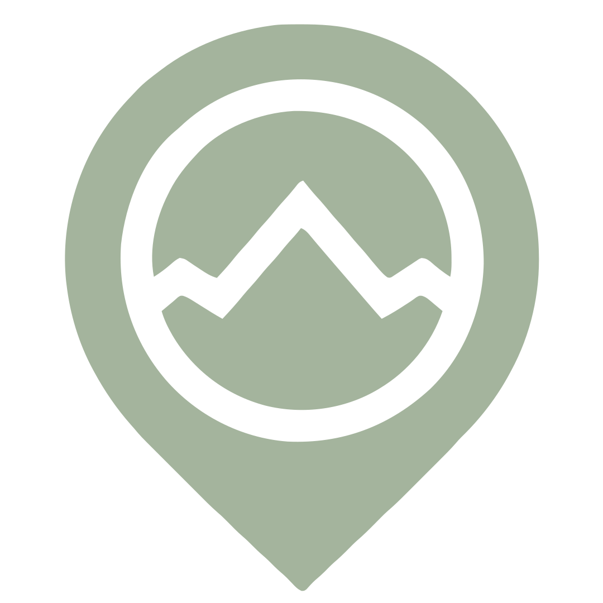

     
    
     

 

<h1 align="center"> GeoJot 🏔️📍 </h1>
 
<h4 align="center">  
A simplistic, open-source, and easy-to-use geo-location app meant to allow for users to share favorite locations to other users. 
</h4> 

  
  
  
  
   

<h3 align="center"> 📝 Table of Contents</h3>

  <a href="#-️--about-the-project">About</a> •
  <a href="#---key-features">Key Features</a> • 
  <a href="#-️--installation">Installation</a> •
  <a href="#---how-to-use">How To Use</a> •
  <a href="#credits">Credits</a>

<!-- ABOUT THE PROJECT -->
## [ 🏔️ ] About The Project

<!-- [![Product Name Screen Shot][product-screenshot]](https://example.com) -->

This project orginated as a passion project for me to learn more about Nest.JS and TypeScript development alongside using OpenStreetMaps. I never was able to find a geo-loocation app that I could store information and trip histories for spots I've wanted to share with others. This app was born out of that passion and I hope to eventually make it a useful tool for others to use. This is a WIP project and I will be adding more features as I continue to learn and develop. The project will focus on a web-browser app, however, I plan to add a mobile app in the future (Possible migrate with Capacitor).

(<a href="#readme-top">back to top</a>)

## [ 🔑 ] Key Features 

### 🧑‍💻👩‍💻 Accounts and Authentication  
- [ ] Account creation, login, and logout
- [ ] User profile and settings page 
- [ ] Friend requests and friend list 
- [ ] Sharing spots with friends 

### 📍 Geo-location
- [ ] Main map interface 
- [ ] Search for locations or created pins  
- [ ] Easy to use pinning system 
- [ ] Add friends pins to your main map
- [ ] Add photos, track trips, and add notes for a certain pin 

### 🧗 Import Reach Features 
- [ ] Live Location tracking to allow for users to make trails to a location. Starting point / ending point  
- [ ] Show pins 

(<a href="#readme-top">back to top</a>)

<!-- GETTING STARTED -->
## [ 💻 ] How to Use: 

- [ ] TODO: Add instructions on how to use the app / certain key features

## [ ⚙️ ] Installation 

- [ ] TODO: Add instructions on how install the and run the app

(<a href="#readme-top">back to top</a>)

<!-- Credits -->
## [ ➕ ] Credits  

- [ ] TODO: Add Credits on any logos, libraries, or other resources used in the project that need to be credited

(<a href="#readme-top">back to top</a>)

<!-- MARKDOWN LINKS & IMAGES -->
<!-- https://www.markdownguide.org/basic-syntax/#reference-style-links -->
[issues-shield]: https://img.shields.io/github/issues/othneildrew/Best-README-Template.svg?style=for-the-badge
[issues-url]: https://github.com/othneildrew/Best-README-Template/issues
[license-shield]: https://img.shields.io/github/license/othneildrew/Best-README-Template.svg?style=for-the-badge
[product-screenshot]: images/screenshot.png
[React.js]: https://img.shields.io/badge/React-20232A?style=for-the-badge&logo=react&logoColor=61DAFB
[React-url]: https://reactjs.org/
[Vue.js]: https://img.shields.io/badge/Vue.js-35495E?style=for-the-badge&logo=vuedotjs&logoColor=4FC08D
[Vue-url]: https://vuejs.org/
[Angular.io]: https://img.shields.io/badge/Angular-DD0031?style=for-the-badge&logo=angular&logoColor=white
[Angular-url]: https://angular.io/
[Svelte.dev]: https://img.shields.io/badge/Svelte-4A4A55?style=for-the-badge&logo=svelte&logoColor=FF3E00
[Svelte-url]: https://svelte.dev/
[Laravel.com]: https://img.shields.io/badge/Laravel-FF2D20?style=for-the-badge&logo=laravel&logoColor=white
[Laravel-url]: https://laravel.com
[Bootstrap.com]: https://img.shields.io/badge/Bootstrap-563D7C?style=for-the-badge&logo=bootstrap&logoColor=white
[Bootstrap-url]: https://getbootstrap.com
[JQuery.com]: https://img.shields.io/badge/jQuery-0769AD?style=for-the-badge&logo=jquery&logoColor=white
[JQuery-url]: https://jquery.com 
